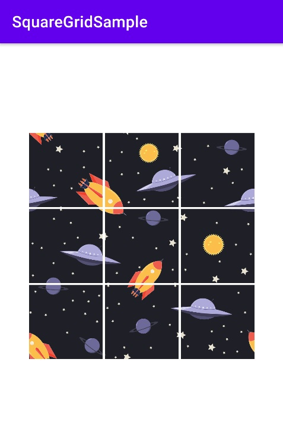

# Android Square Grid Layout (with image slice) example
A sample showing how to use Sqaure Grid Layout viewgroup, which arranges it's children on a square grid.

In this example size is set as 3 (ie 3x3 grid) - bitmap is loaded from assets and it is sliced into 3x3 bitmaps and loaded in imageview.

uses [tom gibara's square layout](https://gist.github.com/tomgibara/717450)
